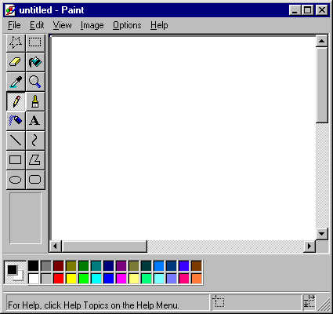

# Understanding jQuery - Paint

This project aims to make you understand the basic manipulation of `DOM` creating a program! A bit like **Microsoft Paint**.



Our `index.html` file contains 5400 divs. Divs are small black square. These squares represent each pixel of our program. You does not preoccupy the **HTML** & **CSS**. Just our file named `app.js`.

## Step 1 - Add Class

The first thing to do in our "pixels" is to change the color. These little guys are the building blocks of our artwork. With v1 our application, we'll just make black and white pixels. Not because we can not have colors, but we will need to create a few features for v2?

- Initialize our file `app.js` by loading the document when it is ready.

```javascript
  $(document).ready(function () {
  // your code
  });
```

All your code will be between these lines of code.

- Ensure that when you click on a pixel, it becomes white:
  - In our `index.html` each div have the classe ` box`
  - We can use this class as our `box` selector. This gives us a way to interact with your `DOM`

```javascript
  $('.box').on('click', function () {
    $('.box').addClass('white');
  });
```

Our `style.css` file have a class named `white`. Everything it does is to change the background from black to white boxes.

In theory, it would change the black box to click on `white` box, but what's happening when you try?
It seems that when you click on a box, all our boxes are changed into white!

Indeed, they all share the same class with the name of the `box`. We are telling **jQuery** that everything which refers to the `box` class should be `white` class. This is a common problem in **jQuery**. Now we could give each div in the list of 5400 divs their own unique ID, but I have a better idea.

- Use the keyword `this`:

```javascript
  $('.box').on('click', function () {
    $(this).addClass('white');
  });
```

The keyword `this` is really common in JavaScript, and it can be confused. In this case, our **jQuery** code, it refers to the specific case on which we clicked. Often you find yourself in positions where you need to change something in a picture of many. If you ever find yourself in changing each of them, experiment with `this` a bit.

## Step 2 - Editions

Great, now we can create beautiful works of art, art in black and white, but art nonetheless. But what happens when we make a mistake? There is no way to change our work. We'll fix that.

- Ensure that when you double click, it changes back to black with `removeClass`:

```javascript
  $('.box').on('click', function () {
    $(this).addClass('white');
  });

  $('.box').on('dblclick', function () {
    $(this).removeClass('white');
  });
```

## Step 3 - Reset button

It seems we have a reset button. Let it run. Remember how we could send blanket orders on all our pixels using the class name instead of individual pixel? We will use this method to create our reset button.

- Be sure your buttons are white:

```javascript
  $('#reset').on('click', function () {
    $('.box').removeClass('white');
  });
```

## Step 4 - Color Palette

Let our color buttons work!

- Create a color variable, and set the default blank. This color variable is the class we add.

`` `Javascript
  var color = 'white';
`` `

- Create a click event for each color that changes the color of variable on click:

`` `Javascript
  $ ( '# Red'). It ( 'click', function () {
    color = 'red';
  });

  $ ( '# Blue'). It ( 'click', function () {
    color = 'blue';
  });

  $ ( '# Green'). It ( 'click', function () {
    color = 'green';
  });

  $ ( '# Yellow'). It ( 'click', function () {
    color = 'yellow';
  });

  $ ( '# White'). It ( 'click', function () {
    color = 'white';
  });
`` `

- Update the `class functionality add` to reflect our color variable rather than our actual class names:

`` `Javascript
  $ ( '. Box'). It ( 'click', function () {
    $ (This) .addClass (color);
  });

  $ ( '. Box'). One ( 'dblclick', function () {
    $ (This) .removeClass (color);
  });

  $ ( '# Reset'). It ( 'click', function () {
    $ ( '. Box'). RemoveClass (color)
  });
`` `

One last thing that is a little messed up. Our reset functions and double-click does not work yet. Because we set the variable `color` instead of the action of class suppression, it will only observe the currently selected color.

In the jQuery function we have the ability to delete multiple classes of only separating each class, we want to remove by a space, as follows:

`` `Javascript
  $ ( 'Box.') RemoveClass ( 'red blue green yellow white.');
`` `

What is feasible, but we'll just put those in a variable so that we do not need to write much code:

`` `Javascript
  var colors = 'white blue green red yellow'
  
  $ ( '. Box'). One ( 'dblclick', function () {
    $ (This) .removeClass (colors);
  });

  $ ( '# Reset'). It ( 'click', function () {
    $ ( '. Box'). RemoveClass (colors)
  });
`` `

And now it's over, we finished our setup application. Feel free to add functionality. Enjoy!
